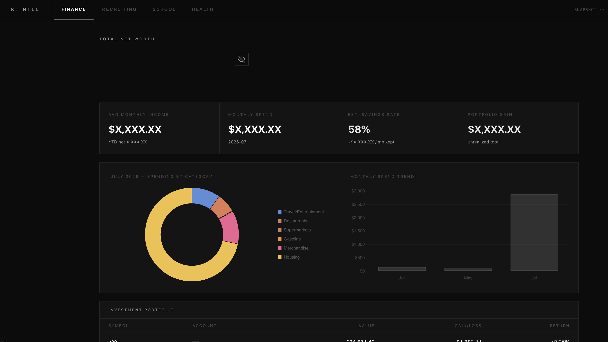
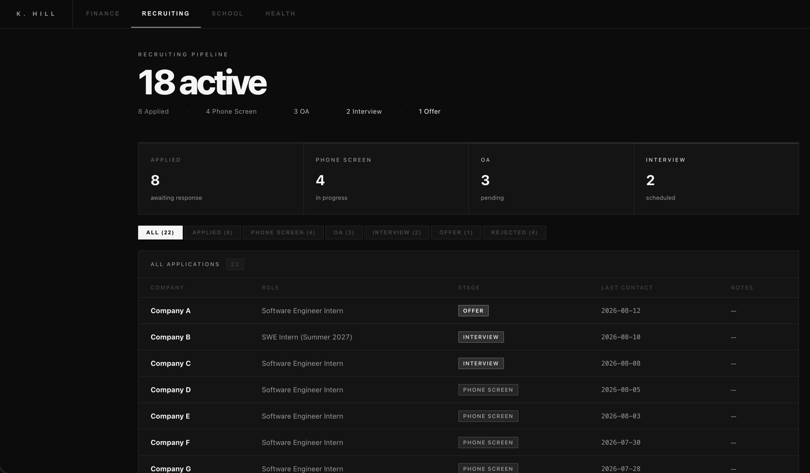
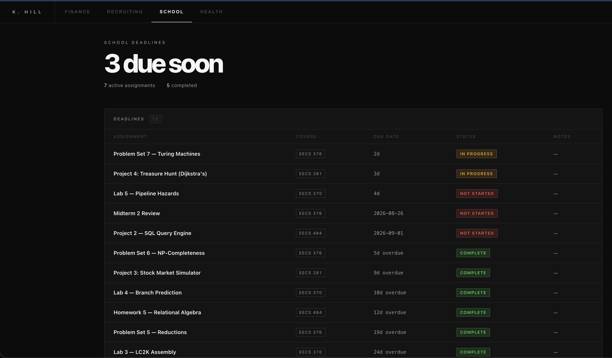
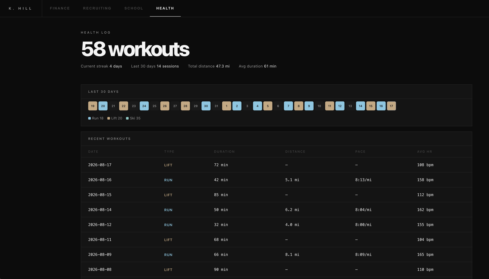

# Life OS

A personal dashboard that keeps every corner of my life in one place — recruiting pipeline, finances, school deadlines, and fitness — all pulled automatically from Gmail, Apple Health, and bank exports, and deployed privately on Vercel behind auth.

---

## Finance

Net worth breakdown, monthly spend by category, investment portfolio P&L, and progress toward annual savings goals — fed by CSV exports from 6 bank and brokerage accounts.



---

## Recruiting

Full internship pipeline auto-populated from Gmail — stage inferred from email signals (Applied → Phone Screen → OA → Interview → Offer), zero manual entry.



---

## School

Assignment deadlines extracted from Canvas and Gradescope emails, surfaced by urgency with status tracking.



---

## Health

Workout log pulled from Apple Health exports — runs, lifts, and ski days with pace, heart rate, duration, and a 30-day activity calendar.



---

## Make it yours

This is designed to be forked and adapted. Every panel is an independent module — adding a new data source means writing a scraper and a classifier, wiring it into `main.py`, and dropping a new panel into the React frontend. The data lives in plain JSON files you control, the dashboard deploys to your own Vercel project, and Supabase auth keeps it private.

Things people might track that aren't here yet: sleep, nutrition, job applications outside recruiting season, reading lists, budget categories, net worth milestones, travel plans. If it produces data, it can be a panel.

**To get started:**

```bash
git clone https://github.com/khill-2/myOS.git
cd myOS
python -m venv venv && source venv/bin/activate
pip install -r requirements.txt
npm install
```

Set up credentials (Google OAuth for Gmail, Supabase for auth) following the notes in `CLAUDE.md`, then:

```bash
python main.py --dry-run   # preview what would be scraped
python main.py             # live run — scrapes, classifies, rebuilds site
```

---

## Architecture

```
Gmail (2 accounts, OAuth 2.0)  ──┐
Apple Health export (XML)       ──┼──▶  classifier.py  ──▶  data/*.json  ──▶  dashboard.json  ──▶  Vercel
Bank CSV exports (6 accounts)  ──┘
```

| File | Role |
|---|---|
| `main.py` | Orchestrator — CLI flags, account routing, site rebuild |
| `gmail_scraper.py` | OAuth 2.0 per account, Gmail API fetch |
| `classifier.py` | 3-tier filter: blocklist → signal detection → field extraction |
| `json_writer.py` | Deduplicating writes to `data/*.json` |
| `health_scraper.py` | Apple Health XML export parser |
| `csv_scraper.py` | Bank CSV normalizer across 6 institutions |

**Stack:** Python · Gmail API · Apple Health · React · Vite · Supabase Auth · Vercel
